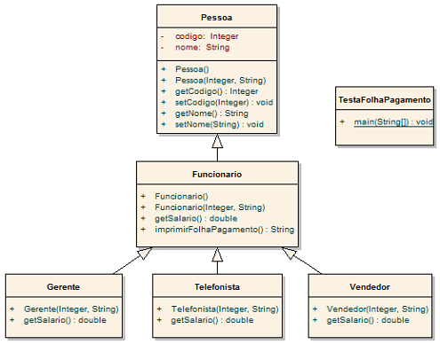

Lista de Exercícios - Herança
1. (Prática) Uma empresa possui definido o seu escopo organizacional um padrão para pagamento de salário. Todos os funcionários recebem R$ 2.000,00 de salário líquido mais um acréscimo por cargo exercido. O Gerente recebe o salário liquido mais 45%. A Telefonista recebe o salário líquido mais 10%. O Vendedor recebe o salário líquido mais 25%.

a) Sua tarefa é construir o programa "Folha de Pagamento" para realizar o cálculo da folha, conforme os cargos citados anteriormente.

b) Analise no diagrama abaixo os objetos Gerente, Telefonista e Vendedor verificando suas dependências relacionadas a herança identificando o que deve ser alterado nestes objetos para permitir que a folha de pagamento seja gerada com os percentuais solicitados.

Figura 1: Diagrama de Classe representando a Folha de Pagamento

2. (Prática) Um banco mantém o cadastro de dois tipos de contas: conta corrente e conta poupança. Para todas as contas, o banco deve conhecer: número da conta, nome do cliente e saldo atual. Deve-se conhecer também se uma determinada conta corrente utiliza cheques ou não. Para uma conta poupança um rendimento deve ser aplicado. Para todas as contas, deve ser possível sacar, depositar e verificar o saldo atual.
   Levando em conta esta descrição, modele e implemente as classes necessárias para o funcionamento do banco. Crie uma classe utilitária (com método main) que cria algumas contas (de ambos os tipos).

3. Aponte qual é o erro existente na implementação abaixo. O que você faria para resolver este problema?

public class Veiculo {

    public void moverVeiculo(){
        System.out.println("Movendo o veiculo...");
    }
}

public class Motocicleta {

    public void estacionar(){
        //implementação do método
    }
}

public class TestaVeiculo {

    public static void main(String args[]){
        Motocicleta moto = new Motocicleta();
        moto.moverVeiculo(); // <- O ERRO está aqui.
        moto.estacionar();
    }
}

---
### O erro ocorre porque moto não herda de Veiculo, então ela não tem acesso ao método moverVeiculo.

### Para resolver o problema, bastar dar um Motocicleta extends Veiculo, assim ela terá acesso aos métodos da classe Veiculo.

---

4. Tendo como referência as classes implementadas no item 3, explique se o código abaixo está ou não correto. Por quê?
   
    
public class TestaVeiculo {

    public static void main(String args[]){
 
    Veiculo vei = new Veiculo();

    vei.estacionar();}}

### Errado, o método estacionar pertence a classe Motocicleta e Veiculo não herda ele.

