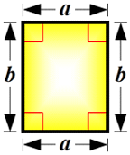
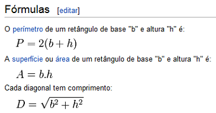
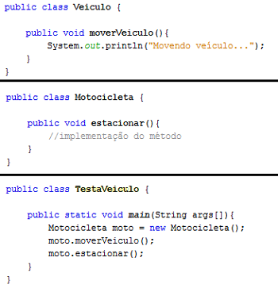
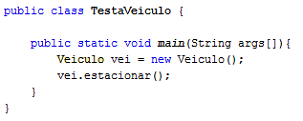

Disciplina: Programação II
Professor(a): Matheus Leandro Ferreira

Lista de Exercícios - Herança

1. (Prática)

Um retângulo é um paralelogramo, cujos lados formam ângulos retos entre si e que, por isso, possui dois lados paralelos verticalmente e os outros dois paralelos horizontalmente.

Pode-se considerar o quadrado como um caso particular de um retângulo em que todos os lados têm o mesmo comprimento.

(Fonte: http://pt.wikipedia.org/wiki/Ret%C3%A2ngulo)

Crie uma classe chamada Retangulo com os atributos "comprimento e largura". Crie métodos que calculem a área e o perímetro do retângulo.  A classe deve possuir métodos set e get para os atributos comprimento e a largura. Os métodos set devem verificar se o comprimento e a largura são, cada um, números de ponto flutuante maiores que 0 e menores que 20. Escreva um programa para testar a classe Retangulo.

---

2. (Prática) Crie uma classe chamada Relogio. Adicione os atributos hora, minuto e segundo definidos como private e tipo de dado int.

Crie os seguintes métodos para alterar e controlar o estado do objeto.

2.1 Crie um método chamado "acertar relógio" que receba como parâmetro a hora, minuto e segundo.
Utilize o comando condicional "if" para criar o seguinte controle sobre os dados passados por parâmetro.
a) Nenhum dos parâmetros pode ser informado com valores negativos.
b) A maior hora que poderá ser informada é 23.
c) O maior minuto e segundo que poderá ser informado é 59.

2.2 Crie os métodos abaixo para acertar o relógio.
a) Incrementar para o próximo minuto.
b) Incrementar para a próxima hora.
c) Incrementar para o próximo segundo.

Cada um destes métodos deve gerenciar seu respectivo tempo (contador) com sua dependência.
Exemplo:
Hora atual: 11:59:59
- Após chamar o método proximoSegundo() a hora atual será: 12:00:00
- Após chamar o método proximoMinuto() a hora atual será: 12:00:59
- Após chamar o método proximaHora() a hora atual será: 12:59:59

2.3 Crie um método chamado hora atual para apresentar a hora do relógio no formato HH:mm:ss. As informações devem ser impressas no console com System.out.println("")

2.4 Crie uma classe com o método main para testar a classe Relogio.

---

3. Crie uma classe chamada Ingresso que possua um atributo valor e um método toString que retorne à informação do valor do ingresso.

* Crie uma classe IngressoVIP, que herda de Ingresso e possui um atributo valor Adicional. O método toString da classe IngressoVIP deve considerar que o valor do ingresso é o valor da superclasse somado ao valor Adicional do IngressoVIP.
* Crie uma classe para testar os objetos das classes Ingresso e IngressoVIP.

---

4. O que é um método construtor?

5. Quando uma classe é instanciada (new) qual é o primeiro método a ser executado por padrão (default)?

6. Para que serve a palavra reservada "this"? Cite um exemplo de sua utilização. (Converse com os integrantes da equipe)

7. Escreve uma classe Java que represente a aplicação de herança entre as classes Animal e Passaro

8. Na classe Animal está implementado o método abaixo, que apresenta no console a mensagem "Eu sou um animal".

É necessário que para a classe Passaro a mensagem apresentada seja "Eu sou um pássaro... eu já sei voar...". Faça as devidas implementações para que a classe pássaro apresente este novo comportamento.

9. Qual é a palavra reservada do Java utilizado para aplicar o conceito de herança, como por exemplo, definir que um pássaro "é um" animal.

10. Entre as classes Passaro e Animal, quem é a superclasse e quem é a subclasse?

11. (Prática) Um banco mantém o cadastro de dois tipos de contas: conta corrente e conta poupança. Para todas as contas, o banco deve conhecer: número da conta, nome do cliente e saldo atual. Deve-se conhecer também se uma determinada conta corrente utiliza cheques ou não. Para uma conta poupança um rendimento deve ser aplicado. Para todas as contas, deve ser possível sacar, depositar e verificar o saldo atual.
    Levando em conta esta descrição, modele e implemente as classes necessárias para o funcionamento do banco. Crie uma classe utilitária (com método main) que cria algumas contas (de ambos os tipos).

12. Aponte qual é o erro existente na implementação abaixo. O que você faria para resolver este problema?

13. Tendo como referência as classes implementadas no item 12, explique se o código abaixo está ou não correto. Por quê?

14. Explique quando utilizar os modificadores de acesso private, public e protected. Cite quais são as notações UML utilizadas para cada um deles. . (Converse com os integrantes da equipe)

15. Explique para que serve a palavra reservada super.

16. (Prática) Escreva uma classe Java que demonstre a utilização da palavra reservada super(...) para chamar o construtor da super classe.

17. (Prática) Escreva uma classe em Java que demonstre a utilização da palavra reservada super para chamar métodos cuja implementação tenha sido redefinida na subclasse.
