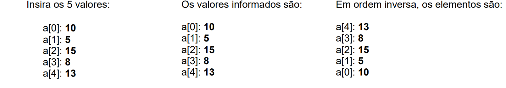

Lista de Exercícios - Só com Vetores

1) Elabore um programa que entre com 7 números inteiros e imprima uma listagem contendo os 7 números.

2) Elabore um programa em Java que leia 5 valores do tipo int em um vetor A. Ao final, imprima todos os elementos do vetor, em ordem normal e ordem inversa, conforme o exemplo abaixo:

3) Elabore um programa em Java que leia 5 valores do tipo int em um vetor A. Ao final, imprima todos os elementos, o maior, o menor, e a média dos valores informados.

4) Elabore um programa que armazene números em dois vetores inteiros de cinco elementos cada (A e B), gere e imprima o vetor soma.

5) Elabore um programa que entre com 5 números inteiros em um vetor A, e gere e imprima o vetor T triplo, que deverá conter os elementos do primeiro vetor multiplicados por 3.

6) Elabore um programa que leia um vetor X com 10 números e calcule e imprima a diferença entre o maior e o menor elemento existente no vetor, bem como as posições que o maior e o menor ocupam no conjunto de dados.

7) Elabore um programa que entre com 5 números inteiros em um vetor A, e imprima o índice do primeiro número negativo, se houver. Caso não existam números negativos, imprimir a seguinte mensagem "Negativo não encontrado".

8) Elabore um programa que entre com 5 números inteiros em dois vetores A e B. Construir um vetor C, sendo este a junção dos vetores A e B. Dessa forma, C deve ter o dobro de elementos dos vetores A e B. Ao final, imprima os elementos dos 3 vetores.

9) Dado um vetor A de 5 elementos, elabore um programa que ordene esse vetor, e, ao final, imprima esse vetor ordenado.

10) Dado um vetor A de 5 elementos, elabore um programa que solicite ao usuário um número e verifique se esse número encontra-se inserido no vetor. Caso o elemento esteja inserido no vetor, deve-se exibir uma mensagem indicando que o elemento foi encontrado e sua posição, caso contrário, exibir a seguinte mensagem "Elemento não encontrado"
